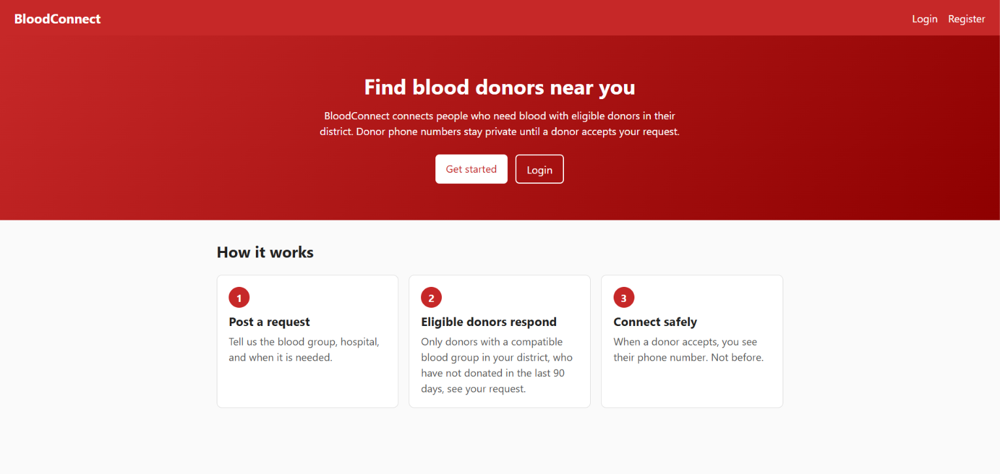
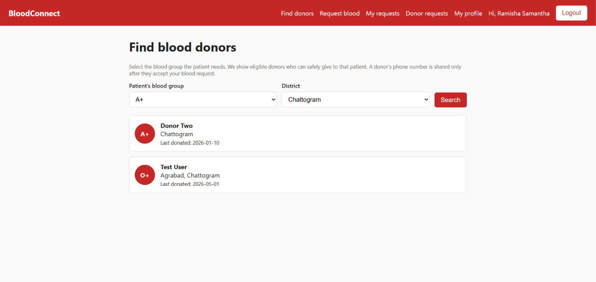
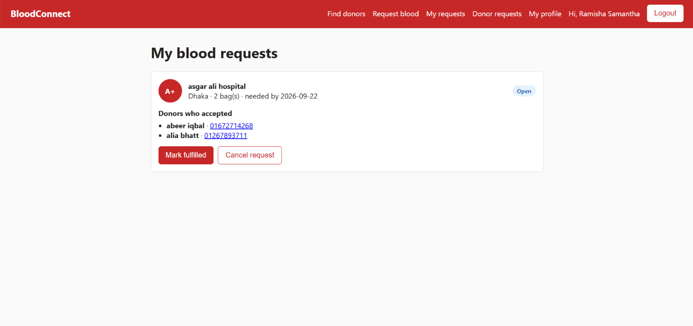
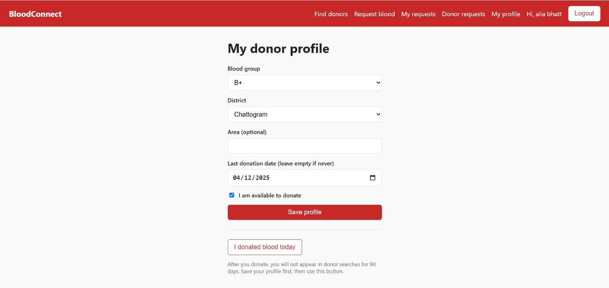

# BloodConnect

A full stack web app that helps people find eligible blood donors in their district. Donors' phone numbers stay private until a donor chooses to accept a request.

**Live demo:** https://bloodconnect-19m9.onrender.com

_Hosted on free tiers, so the first load can take up to a minute while the server wakes up._

## Screenshots

| Home | Find donors |
|---|---|
|  |  |

| My requests | Donor profile |
|---|---|
|  |  |

## Features

- Register and login with hashed passwords (bcrypt) and JWT tokens
- Donor profile: blood group, district, area, last donation date, availability
- Donor search using blood group compatibility and a 90-day eligibility rule
- Blood requests: post a request, matching donors accept or decline
- Privacy by design: a donor's phone number is shown only to the requester, and only after the donor accepts
- Requesters can mark a request fulfilled or cancelled; donors can record a new donation

## Tech stack

- **Frontend:** React (Vite), React Router
- **Backend:** Node.js, Express
- **Database:** PostgreSQL, plain SQL with the `pg` library and parameterized queries
- **Auth and security:** bcryptjs, JSON Web Tokens, helmet, express-rate-limit
- **Testing:** Node's built-in test runner
- **Hosting:** Render (frontend and API), Neon (PostgreSQL)

## How matching works

- **Compatibility:** each patient blood group maps to the donor groups that can give to them (for example, an A+ patient can receive from A+, A-, O+ and O-).
- **Eligibility:** a donor appears in search only if they are marked available and their last donation was more than 90 days ago (or they have never donated). This is a simplified rule for the project, not medical advice.

## Design decisions

- **Authorization in the query:** for example, only the owner of a request can change it (`WHERE id = $1 AND requester_id = $2`), so other users get "not found".
- **User id comes from the token,** never from the request body, so nobody can edit another user's profile.
- **Same error for wrong email or wrong password,** so attackers can't tell which emails are registered.
- **Dates are returned as plain `YYYY-MM-DD` strings** to avoid timezone shifts.

## Run locally

Requirements: Node.js 22 or newer and PostgreSQL.

1. Clone the repo and create a PostgreSQL database (for example `bloodconnect`).
2. Run the SQL in `backend/db/schema.sql` on that database (pgAdmin's Query Tool works).
3. Create `backend/.env` from `backend/.env.example` and fill in your values.
4. Start the backend:

```bash
cd backend
npm install
npm run dev
```

5. Start the frontend in a second terminal:

```bash
cd client
npm install
npm run dev
```

6. Open http://localhost:5173

Run the unit tests with `npm test` inside `backend`.

## API overview

| Method | Endpoint | Purpose |
|---|---|---|
| POST | `/api/auth/register` | Create an account |
| POST | `/api/auth/login` | Log in and get a token |
| GET / PUT | `/api/donors/me` | Read or save my donor profile |
| POST | `/api/donors/me/donated` | Record that I donated today |
| GET | `/api/donors/search` | Find eligible donors (blood group, district) |
| POST | `/api/requests` | Post a blood request |
| GET | `/api/requests/open` | Open requests I can help with |
| GET | `/api/requests/mine` | My requests, with accepted donors' contacts |
| POST | `/api/requests/:id/respond` | Accept or decline a request |
| PATCH | `/api/requests/:id/status` | Mark my request fulfilled or cancelled |

## Database

Four tables: `users`, `donor_profiles`, `blood_requests`, `request_responses`. See `backend/db/schema.sql`.

## Ideas for next steps

- Email or SMS notifications for new matching requests
- Pagination and more filters (area, urgency)
- API integration tests and a CI pipeline

Built by [ramisha].